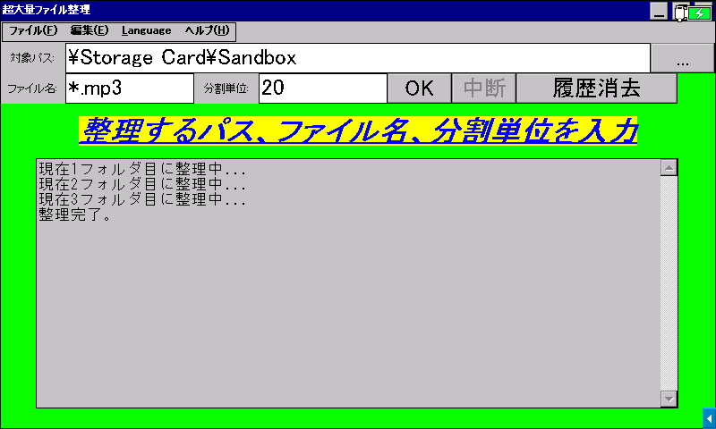

# 超大量ファイル整理

[English](README.md) / **日本語**

大量のファイルを、指定した単位でフォルダに一括整理します。

## 動作環境

### アプリ版

- **Windows 2000 以降**
  - Windows 2000 SP4, XP SP3, 11 で動作確認済み
- **Windows CE .NET 4.0 以降**
  - [SHARP Brain PW-SH1](https://jp.sharp/support/dictionary/product/pw-sh1.html) (CE 6.0 with Armv5TEJ CPU), [Sigmarion III](https://www.hpcfactor.com/hardware/devices/141/NTT_Do_Co_Mo/Sigmarion_III) (CE 4.1 with Armv4 CPU), [MobilePro 900](https://www.hpcfactor.com/hardware/devices/134/NEC/MobilePro_900) (CE 4.2 with Armv5TE CPU), [HP t5540](https://www.hpcfactor.com/hardware/devices/254/Hewlett_Packard/t5540) (CE 6.0 R3 with x86 CPU) で動作確認済み
- **[Wine](https://www.winehq.org/)**
  - macOS や Linux 等で動作させる場合に使用します
  - M2 MacBook Air にて AMD64 版が Rosetta 2 で動作することを確認済みです

SHARP Brain について、対応機種や実行方法等の情報は [Brain Wiki](https://brain.fandom.com/ja/wiki/%E3%82%A2%E3%83%97%E3%83%AA%E3%81%AE%E8%B5%B7%E5%8B%95%E6%96%B9%E6%B3%95) を参考にしてください。日本語で使用する場合は電子辞書の日本語化が必要です。

### Batch File 版

Windows PC 環境であれば概ね動作するはずです。Windows CE に搭載されているコマンドプロンプトで動作するかは分かりません（SHARP Brain には `cmd.exe` が存在すらしません）。

## 使い方

> [!WARNING]
> 「中断」ボタンで中断できますが、既に振り分けられたファイルを元に戻す機能はありません。事前に付属の `Sandbox` フォルダ（ダミーファイルを 100 個入れたテスト用空間）で動作を確認するなど、十分注意して使用してください。

### アプリ版

> [!NOTE]
> 一部のセキュリティソフトは、署名のない個人開発のソフトウェアをマルウェアと誤判定します。この現象に遭遇した場合は、チェスト等の隔離空間から復元／許可して実行してください。ソフトウェアの安全性に関して心配な場合は、ソースコードを確認して自分でコンパイルすることもできます。

[Releases](../../releases) からご使用のコンピュータに合った実行ファイルを取得し、実行します。インストール作業は不要です。アンインストールも、レジストリ等は使用しないので実行ファイルを削除するだけで可能です。

1. 入力ボックスの右の `...` ボタンから、対象のフォルダをフルパスで指定します
1. 対象のファイル名パターンをワイルドカードを使用して指定します
   - 全てのファイルを対象とする場合： `*`
   - MP3 ファイルのみを対象とする場合： `*.mp3`
1. 何ファイル単位に振り分けるかを指定します
   - SHARP Brain において、数値は本体キーボード（アルファベット入力状態のままで OK）で入力できます
1. 以上の設定を確認して、OK または Enter キーを押します

基本的には辞書順に振り分けられるはずです。ファイルの数が極端に多い場合、処理完了後にプログラムが落ちる場合がありますが、大抵の場合処理自体は正常に完了しているため、問題はない...はずです。

オプションの Language から言語の切り替えが可能です。

### Batch File 版

`organize.bat` か `organize-ja.bat` を整理したいフォルダで実行し、指示に従って入力します。

## 利用許諾条件（ライセンス）

[MIT License](LICENSE) で配布します。当ソフトウェアを利用する際には必ず確認してください。
