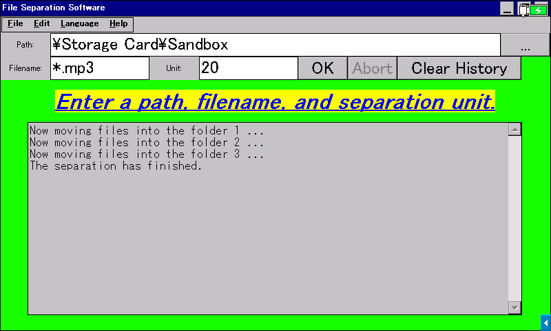

# File Organizer

**English** / [日本語](README-JA.md)

This software separates a massive amount of files into folders by specified separation unit.

## Supported Platforms

### GUI App

- **Windows 2000 or later**
  - Tested on Windows 2000 SP4, XP SP3, and 11.
- **Windows CE .NET 4.0 or later**
  - Tested on [SHARP Brain PW-SH1](https://jp.sharp/support/dictionary/product/pw-sh1.html) (CE 6.0 with Armv5TEJ CPU), [Sigmarion III](https://www.hpcfactor.com/hardware/devices/141/NTT_Do_Co_Mo/Sigmarion_III) (CE 4.1 with Armv4 CPU), [MobilePro 900](https://www.hpcfactor.com/hardware/devices/134/NEC/MobilePro_900) (CE 4.2 with Armv5TE CPU), and [HP t5540](https://www.hpcfactor.com/hardware/devices/254/Hewlett_Packard/t5540) (CE 6.0 R3 with x86 CPU).
- **[Wine](https://www.winehq.org/)**
  - Enables macOS and Linux to run this File Organizer.
  - Tested the AMD64 version on M2 MacBook Air (Rosetta 2).

Read [Brain Wiki](https://brain.fandom.com/ja/wiki/%E3%82%A2%E3%83%97%E3%83%AA%E3%81%AE%E8%B5%B7%E5%8B%95%E6%96%B9%E6%B3%95) to learn supported Sharp Brain electronic dictionaries and how to run this software.

### Batch File

We suppose almost all Windows PC platforms can run this batch file. We don't know whether it works on the command prompt bundled in Windows CE (Sharp Brain electronic dictionary doesn't have `cmd.exe` at all).

## How To Use

> [!WARNING]
> Although you can abort, this software does NOT have a feature to set back the moved files. Use with caution, and we recommend you to first test the behavior of this software in the attached `Sandbox` folder, which contains 100 dummy files.

### GUI App

> [!NOTE]
> Some pieces of anti-malware software falsely labels software from individual developers as malware. If you faced this behavior on this software, restore it from the chest or allow it. You can check out the source code and build it yourself if you are not sure whether this software is safe.

Download an appropriate one from [Releases](../../releases) and run it on your device. No installation needed. You can also uninstall this software just by removing the executable file itself, as it doesn't touch the system registry or such.

1. Specify a full path of a folder to organize using the `...` button
1. Specify a filename pattern using wildcards
   - To organize all files in the directory, specify `*`
   - To organize only MP3 files, specify `*.mp3`
1. Specify a separation unit
   - You can use the top row (QWERTY...) keys to input numbers if your device does not have number keys
1. Make sure the settings are correct, then press the OK button or Enter key to start organizing

Files are normally organized in alphabetical order. Although this software sometimes crashes when the target directory have whole bunch of files to organize, the files are usually correctly organized.

You can switch the UI language at "**Options -> Language**".

### Batch File

Run either `organize.bat` or `organize-ja.bat` in a folder you want to organize, and then follow the instructions.

## License

This software is licensed under the [MIT License](LICENSE). You must agree with the licensing terms to use this software.
